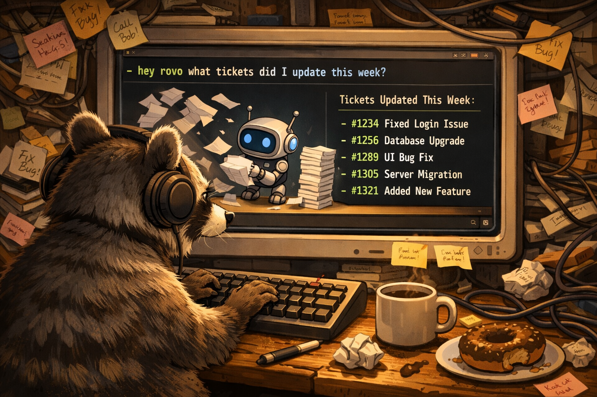

<p align="center">
  
</p>

<h1 align="center">hey-rovo</h1>

<p align="center">
  Talk to Atlassian Rovo from your terminal.<br>
  One bash script. No API key. No dependencies.
</p>

<p align="center">
  <a href="#setup">Setup</a> &middot;
  <a href="#usage">Usage</a> &middot;
  <a href="#how-it-works">How it works</a> &middot;
  <a href="LICENSE">MIT License</a>
</p>

---

```
$ rovo "what tickets did I update this week?"

1. PROJ-42 - Fix the thing that broke the other thing
2. PROJ-99 - Add dark mode (finally)
3. PROJ-7  - Update docs nobody reads
```

Rovo doesn't have a public API. This script doesn't care. It grabs your browser session cookie and hits the same streaming endpoint the chat widget uses.

## Setup

```bash
curl -fsSL https://raw.githubusercontent.com/otherland/hey-rovo/main/install.sh | bash
```

Or clone it yourself:

```bash
git clone https://github.com/otherland/hey-rovo.git
cd hey-rovo
cp .env.example .env
```

Either way, you need a session token. Takes about 30 seconds:

1. Open your Atlassian site in Chrome
2. DevTools (`Cmd+Option+I`) > **Application** > **Cookies**
3. Find `tenant.session.token`, copy the value
4. Paste into `~/.hey-rovo/.env` (or `.env` if you cloned manually)

```env
ROVO_BASE_URL="https://yoursite.atlassian.net"
ROVO_SESSION_TOKEN="eyJraWQ..."
```

Token lasts about 30 days. When it stops working, grab a fresh one.

## Usage

```bash
rovo "how do we deploy to production?"
rovo what tickets are blocked right now
rovo "summarise the last sprint retro"
```

## How it works

```
you → curl → Rovo SSE endpoint → grep + sed → terminal
```

Each question starts a fresh conversation. Set `ROVO_CONVERSATION_ID` in `.env` if you want to keep a thread going.

The whole thing is ~40 lines of bash. No Python, no Node, nothing beyond `curl` and `uuidgen` (both ship with macOS and most Linux).

## License

MIT
